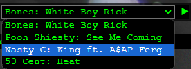

# YouTube Audio Player Component

A custom React.js component for controlling an audio playlist of YouTube videos. The component allows users to select songs from a predefined list, play, pause, and navigate between them.

## Features

- **Playlist Selection**: Choose from a list of YouTube videos.
- **Play/Pause Control**: Easily toggle between play and pause.
- **Navigation**: Navigate through the playlist with previous and next buttons.
- **Auto Play Next**: Automatically plays the next song when the current one ends.

## Easy Setup

```
 const [songUrls, setSongUrls] = useState([
        { title: 'Bones: White Boy Rick', url: 'https://www.youtube.com/watch?v=I4jh4ojwSoM' },
        { title: 'Pooh Shiesty: See Me Coming', url: 'https://www.youtube.com/watch?v=VlpJPgINMRI' },
        { title: 'Nasty C: King ft. A$AP Ferg', url: 'https://www.youtube.com/watch?v=KjwuxQmyeyE' }, 
        { title: '50 Cent: Heat', url: 'https://www.youtube.com/watch?v=YCGzRQjX2eQ' },
    ]);
```

## Preview

  
*UI of the YouTube Audio Player Component*